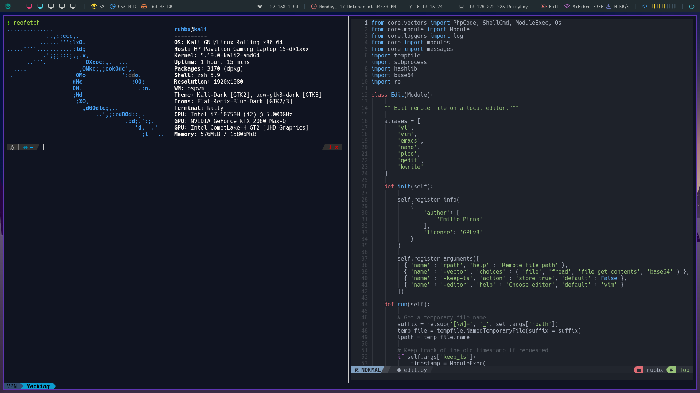

# Graphic preview
<p align="center">
  
</p>


## Interesting data 

- **WM:** [bspwm](https://github.com/baskerville/bspwm)
- **OS:** [Kali Linux](https://www.kali.org/)
- **Terminal:** [kitty](https://github.com/kovidgoyal/kitty)
- **Shell:** [zsh](https://wiki.archlinux.org/index.php/Zsh)
- **Editor:** [neovim](https://github.com/neovim/neovim)
- **Browser:** [firefox](https://www.mozilla.org/en-US/firefox)
- **Application Launcher:** [rofi](https://github.com/davatorium/rofi)

# Installation

````bash
git clone https://github.com/ThunderstrikeES/bspwm-dotfiles

cd bspwm-dotfiles
chmod +x auto-bspwm.sh
./auto-bspwm.sh
